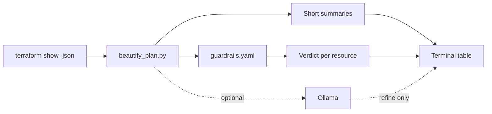

# tf-reviewer

**Readable Terraform plan reviews in your terminal — with policy-driven approval verdicts.**

`tf-reviewer` takes [`terraform show -json`](https://developer.hashicorp.com/terraform/cli/commands/show) output and prints a compact table: what changed, whether it needs a second approver, and why. Policy lives in a **`guardrails.yaml`** file you own. Optional **[Ollama](https://ollama.com/)** integration can polish summaries and risk text; it cannot override locked rules.

```
┌─────────────────────────────┬─────────┬─────────────────────┬──────────────────────────────────┐
│ Resource                    │ Action  │ Before → After      │ Verdict                          │
├─────────────────────────────┼─────────┼─────────────────────┼──────────────────────────────────┤
│ aws_route53_record.api      │ UPDATE  │ ttl 300→60; records…│ APPROVAL REQUIRED — DNS change…  │
│ aws_lambda_function.webhook │ UPDATE  │ add tag:cost-center │ NO APPROVAL — tag-only change    │
└─────────────────────────────┴─────────┴─────────────────────┴──────────────────────────────────┘
```

---

## Features

- **Human-readable diffs** — short, precise `Before → After` summaries (no raw JSON blobs in the table)
- **Binary verdicts** — every change is `APPROVAL REQUIRED` or `NO APPROVAL`
- **Policy as code** — YAML/JSON guardrails: DNS, security groups, IAM, data stores, capacity, tags-only, and more
- **LLM-assisted (optional)** — local Ollama for sharper wording; guardrails stay authoritative
- **CI-friendly** — exit code `2` when any change needs second approval
- **No cloud API keys** — runs offline with `--nollm`

---

## Requirements

- Python **3.10+**
- **PyYAML** — `pip install -r requirements.txt`
- Optional: **Ollama** + a chat model (default: `llama3.1`) when not using `--nollm`

---

## Installation

```bash
git clone https://github.com/YOUR_ORG/tf-reviewer.git
cd tf-reviewer
python3 -m venv .venv
source .venv/bin/activate   # Windows: .venv\Scripts\activate
pip install -r requirements.txt
```

---

## Usage

### 1. Export a Terraform plan as JSON

```bash
terraform plan -out=tfplan
terraform show -json tfplan > plan.json
```

### 2. Review in the terminal

```bash
# Guardrails + Ollama (default)
python3 beautify_plan.py plan.json

# Guardrails only — fast, deterministic, ideal for CI
python3 beautify_plan.py plan.json --nollm --show-rule-ids

# See which rule matched each change
python3 beautify_plan.py plan.json --explain-guardrails --nollm
```

Try the included sample:

```bash
python3 beautify_plan.py plan-output.json --nollm --show-rule-ids
```

---

## Guardrails

Edit [`guardrails.yaml`](./guardrails.yaml) to match your organization. The shipped file is an **example** (payments-style defaults); fork and replace `org_context` and rules for your stack.

**How a verdict is chosen (per resource change):**

1. **Rules** — first match wins → verdict is **locked**
2. **`protected_addresses`** — regex on resource address → always `APPROVAL REQUIRED`, locked
3. **`defaults`** — per action (`create`, `update`, `delete`, `replace`, `no-op`)

With LLM enabled, the model may **escalate** `NO APPROVAL` → `APPROVAL REQUIRED` or refine reason text. It **cannot** downgrade a locked `APPROVAL REQUIRED`.

| Rule id (example) | Typical effect |
|-------------------|----------------|
| `dns-any-change` | Route53 create/update/delete/replace → approval |
| `sg-rule-removed` | SG rule delete/replace → approval |
| `iam-widening` | Wildcard actions / `PassRole` → approval |
| `tags-only` | Only tag attributes changed → no approval |

Match keys include `resource_type`, `action`, `address_regex`, `attribute` globs, `after_contains_any`, `direction` (increase/decrease), and more. See [`GUARDRAILS_PLAN.md`](./GUARDRAILS_PLAN.md) for the full design.

---

## CI integration

Fail the pipeline when the plan needs human approval:

```yaml
# GitHub Actions (example)
- name: Terraform plan review
  run: |
    terraform show -json tfplan > plan.json
    python3 beautify_plan.py plan.json --nollm --strict-guardrails --show-rule-ids
  # Exit 0 = no approval needed
  # Exit 2 = at least one change needs second approval
  # Exit 1 = invalid plan or guardrails
```

Recommended flags for automation: **`--nollm`**, **`--strict-guardrails`**, **`--no-color`**.

---

## CLI reference

| Argument | Description |
|----------|-------------|
| `plan_file` | Path to plan JSON (default: `plan-output.json`) |
| `--llm` | Use Ollama (default) |
| `--nollm`, `--no-llm` | Guardrails-only; no LLM |
| `--guardrails PATH` | Policy file (default: `guardrails.yaml`) |
| `--strict-guardrails` | Fail if guardrails missing or invalid |
| `--show-rule-ids` | Append matched rule id to verdict |
| `--explain-guardrails` | Print rule matches; no table |
| `--ollama-url`, `--ollama-model`, `--ollama-timeout` | Ollama settings |
| `--include-noop` | Include no-op rows |
| `--no-color` | Plain output |

### Exit codes

| Code | Meaning |
|------|---------|
| `0` | OK — no changes require second approval |
| `1` | Error (bad JSON, invalid guardrails, etc.) |
| `2` | One or more changes require second approval |

---

## Repository layout

| File | Purpose |
|------|---------|
| [`beautify_plan.py`](./beautify_plan.py) | Main CLI |
| [`guardrails.yaml`](./guardrails.yaml) | Example approval policy |
| [`plan-output.json`](./plan-output.json) | Sample plan for demos |
| [`beautify.py`](./beautify.py) | Alternate Rich-based viewer (no verdicts) |
| [`GUARDRAILS_PLAN.md`](./GUARDRAILS_PLAN.md) | Guardrails architecture notes |

---

## Architecture (high level)



---

## Contributing

Issues and pull requests are welcome. When adding guardrail rules, include a short `description` and a clear `reason` string for the verdict column.

1. Fork the repo
2. Create a branch (`git checkout -b feature/my-rule`)
3. Test with `plan-output.json` and `--explain-guardrails`
4. Open a PR

---

## License

This project is licensed under the [MIT License](./LICENSE).

---

## Disclaimer

This tool assists human review; it is not a substitute for your change-management or compliance process. Tune `guardrails.yaml` for your environment and treat verdicts as signals, not guarantees.
